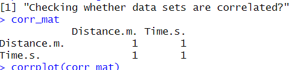

<h1>
    Determining Speed of Sound using Ultrasonic Sensor(HCSR04)
</h1>
<h3>
    <h1>Objective of the Experiment</h1>
    The aim of this expreiment is to determine the speed of sound using the data
    received from the <i>HC-SR04 Ultrasonic Sensor</i> and using statistical methods like
    regression and correlation we can check the relation between the dependant and independant
    variables and regression helps us to extrapolate the data and find the accurate slope as compared
    to raw data.(Temparature is 25-26 degree celcius)
</h3>
<h3>
    I have used the following components,
    <ul>
        
Hardware Cmoponents

        <li>Ultrasonic Sensor HC-SR04</li>
        
        <li>Raspberry Pi Pico</li>
        
        
Software

        <li>R Studio</li>
        <li>Python Programming Language</li>
        <li>Thonny</li>
        <li>Microsoft Excel</li>
    </ul>
    <h2>Final Apparatus Arrangement</h2>
    
</h3>
<h3>
    Methodology
    <h2>How did I carry this experiment out?</h2>
    <ol>
        <li>First things first, I made an apparatus (temparature is 25-26 degrees celcius)which would emit a sound wave and calculate the time required for
            the wave to bounce back. The best component was ultrasonic sensor and I made a combination of Raspberry Pi 
            Pico and ultrasonic sensor (HC-SR04) to make the data collection process easier. I set up the appartus as show in the diagram above.
            
Schematic

            
        </li>
        <li>
            After collecting the data I converted it from a raw form into a csv file, which made data manipulation easier.
            I used python to convert Raw data to csv data. Along with Python I used R Programming Language to manipulate data.
            
Raw Data

            
            
            
            
Summary of Raw Data

            
        </li>
        <li>
            What changes did I do to data? I created a data frame out of the given data set, out of the 3 columns I took Distance of
            the object from the sensor and time required for the wave to bounce back to the sensor. Since, the time required is 
            is calculated for round-trip(wave emitted by sensor hits the object, wave bounces off the object and recieved by sensor) I divide
            the time by 2. (data_copy.csv has the data used for calculation others are un-modified data). Also calculated correlation to check if 
            it has a linear relationship.
            
Correlation Plot

            
            
Correlation Data

            
        </li>
        <li>
            I created the data frame in R Language and plotted it(using line plot) and saw that it has linearity. 
            Instead of going for the direct slope, I used a regression model to extrapolate the values to bigger sample points
            The Slope came out to be 342.99m/s, which is the exact speed of sound and the plot was linear as seen in popular graphs.
            
Raw Data Plot

            
            
Predicted Data Plot

            
        </li>
        <li>
            From the summary of the predicted data using regression model, I could interpret the following relation between Distance and 
            Time. The Intercept was neglible so removing it can cleary give us a linear relation between time and distance.
            
Equation

             
            
Summary of the Regression Data

            
        </li>
    </ol>
</h3>

<h3>
    <h2>Conclusion</h2>
    <h4>In Conclusion, I have proved that speed of sound is 342.99m/s ~ 343m/s under standard room temparature that is 26 degree celcius(minor variations)
        using an HC-SR04 ultrasonic sensor and Raspberry Pi Pico.
    </h4>
    
Final Equation

    
</h3>